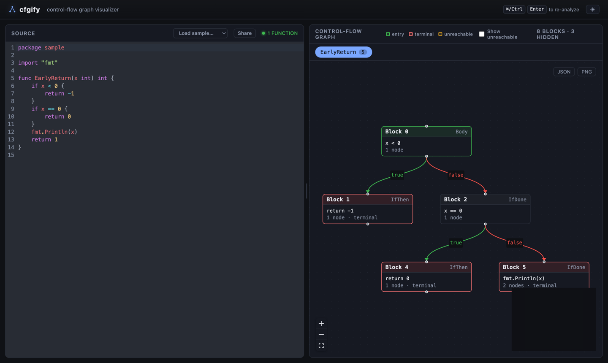

# cfgify

> Visualize the control-flow graph (CFG) of Go functions — in your terminal or your browser.

cfgify is built on [`golang.org/x/tools/go/cfg`](https://pkg.go.dev/golang.org/x/tools/go/cfg). It started as a CLI that pretty-prints the CFG of every function in a Go file, and now also ships a web UI — think [Compiler Explorer](https://godbolt.org), but the right pane is the control-flow graph — served from the same single binary.



## Features

- **CLI** — pretty-print the CFG of every function in a `.go` file, optionally annotated with source positions.
- **Web UI** (`cfgify serve`) — a live editor with Go syntax highlighting whose CFG re-renders as you type. Hover or click blocks to highlight the matching source (and vice-versa), inspect block details, toggle unreachable blocks, switch light/dark, load sample snippets, share a link, and export the graph as PNG or JSON.
- **Single static binary** — the web assets are embedded; no runtime dependencies.

## Install

### Prebuilt binaries (recommended)

Download a release for your platform from the [releases page](https://github.com/mizosoft/cfgify/releases) and put `cfgify` on your `PATH`. Release binaries include the embedded web UI.

### go install

```bash
go install github.com/mizosoft/cfgify@latest
```

This installs the **CLI**. Note that `go install` does not embed the web UI — the frontend is built separately at release time — so `cfgify serve` from a `go install` build serves an informational stub instead of the app. Use a release binary or build from source for the full web UI.

### From source

Requires Go 1.23+ and Node 20+.

```bash
git clone https://github.com/mizosoft/cfgify
cd cfgify
make build        # builds the frontend and embeds it
./cfgify serve
```

## Usage

```
cfgify [-pos] <file.go>            # print CFGs for every function in a file
cfgify serve [--addr H] [--port N] # start the web UI (default 127.0.0.1:8080)
cfgify version                     # print version / build info
```

| Flag | Description |
|------|-------------|
| `-pos` | Annotate each node and governing statement with its source position (`file:line:col`) |

### CLI example

```bash
cfgify sample/sample.go
```

```
╔══════════════════════════════════════════╗
  Function: EarlyReturn
╚══════════════════════════════════════════╝

  4 blocks

  Block 0   Body  [ENTRY]
  ┌──────────────────────────────────────────
  │ gov: {
  │ cond:
  │   x < 0
  │
  └─ true  → Block 1
     false → Block 2

  Block 1   IfThen
  ┌──────────────────────────────────────────
  │ gov: if x < 0 {
  │ ← pred: Block 0
  │  return -1
  │
  └─ (terminal)
  ...
```

### Web UI

```bash
cfgify serve              # then open http://127.0.0.1:8080
cfgify serve --port 3000
```

## Development

The backend is Go; the frontend is React + Vite + CodeMirror + React Flow, under `web/`.

```bash
# Terminal 1 — Go API on :8080
go run . serve

# Terminal 2 — Vite dev server with hot reload (proxies /api to :8080)
cd web && npm install && npm run dev
```

The production build embeds `web/dist` via `//go:embed` behind the `embed_assets` build tag; `make build` runs the frontend build and then compiles with the tag. A plain `go build` (no tag) skips the embed and serves the dev stub, so day-to-day Go builds don't need a frontend build.

## License

[MIT](LICENSE)